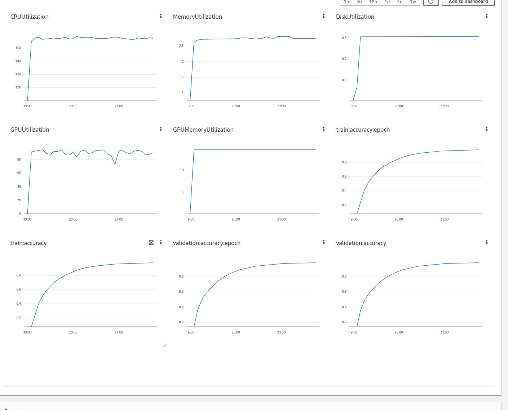
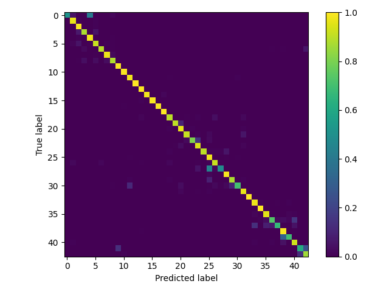

## Info

This repository contains code for a simple, end-to-end ML workflow for traffic sign classification for [GTSRB](https://www.kaggle.com/datasets/meowmeowmeowmeowmeow/gtsrb-german-traffic-sign) dataset. The workflow is implemented with [Amazon SageMaker Pipelines](https://docs.aws.amazon.com/sagemaker/latest/dg/pipelines-sdk.html). The pipeline is defined with [SageMaker SDK](https://sagemaker.readthedocs.io/en/stable/).


The repository is based on a template described in [SageMaker MLOps Project Walkthrough](https://docs.aws.amazon.com/sagemaker/latest/dg/sagemaker-projects-walkthrough.html). Additional references follow:
1. https://github.com/aws-samples/aws-sagemaker-pipelines-skin-classification/
2. https://github.com/aws-samples/amazon-sagemaker-pipelines-mxnet-image-classification/

The pipeline:
  * Splits the dataset and converts it to RecordIO format in  ([pipelines/road_sign/pipeline.py#L112](https://github.com/mleonowicz/dlp-model/blob/main/pipelines/road_sign/pipeline.py#L112)). It is assumed, that the dataset is uploaded to S3 beforehand.
  * Trains a classification model with transfer learning based on an already trained model ([pipelines/road_sign/pipeline.py#L151](https://github.com/mleonowicz/dlp-model/blob/main/pipelines/road_sign/pipeline.py#L151)).
  * Evaluates the model on the test dataset ([pipelines/road_sign/pipeline.py#L199](https://github.com/mleonowicz/dlp-model/blob/main/pipelines/road_sign/pipeline.py#L199)).
  * Registers the model to a model registry ([pipelines/road_sign/pipeline.py#L251](https://github.com/mleonowicz/dlp-model/blob/main/pipelines/road_sign/pipeline.py#L251)) when mean square error from the evaluation is lower than a specified threshold ([pipelines/road_sign/pipeline.py#L273](https://github.com/mleonowicz/dlp-model/blob/main/pipelines/road_sign/pipeline.py#L273)).

Model deployment code will be provided in another [dlp-deploy repository](https://github.com/mleonowicz/dlp-deploy).

Team members:
* [@kjpolak](https://github.com/kjpolak/)
* [@mleonowicz](https://github.com/mleonowicz/)
* [@madziejm](https://github.com/madziejm/)


## Code layout 

```
|-- codebuild-buildspec.yml
|-- CONTRIBUTING.md
|-- pipelines
|   |-- road_sign
|   |   |-- evaluate.py
|   |   |-- __init__.py
|   |   |-- pipeline.py
|   |   `-- preprocess.py
|   |-- create_pipeline_definition.py
|   |-- __init__.py
|   |-- run_pipeline.py
|   |-- _utils.py
|   `-- __version__.py
|-- README.md
|-- sagemaker-pipelines-project.ipynb
|-- setup.cfg
|-- setup.py
|-- tests
|   `-- test_pipelines.py
`-- tox.ini
```

## Code description

A description of some of the artifacts is provided below:

Your code builds execution instructions. This file contains the instructions needed to kick off the execution of the SageMaker Pipeline in the CI/CD system (via CodePipeline). You will see that this file has the fields defined for naming the Pipeline, ModelPackageGroup etc. You can customize them as required.

```
|-- codebuild-buildspec.yml
```


The pipeline artifacts, which include a pipeline module defining the required `create_pipeline` method that returns an instance of a SageMaker pipeline, a preprocessing script that is used in feature engineering, and a model evaluation script to measure the Mean Squared Error of the model that's trained by the pipeline. This is the core business logic:

```
|-- pipelines
|   |-- road_sign
|   |   |-- evaluate.py
|   |   |-- __init__.py
|   |   |-- pipeline.py
|   |   `-- preprocess.py

```


Utility modules for getting pipeline definition JSONs and running pipelines (you do not typically need to modify these):

```
|-- pipelines
|   |-- create_pipeline_definition.py
|   |-- __init__.py
|   |-- run_pipeline.py
|   |-- _utils.py
|   `-- __version__.py
```


Python package artifacts:

```
|-- setup.cfg
|-- setup.py
```


The testing module contains a stub code only:

```
|-- tests
|   `-- test_pipelines.py
```

The `tox` testing framework configuration:
```
`-- tox.ini
```

## Running

Manual deployment from a local host is possible with

``` bash
pip install . && python pipelines/run_pipeline.py --module-name road_sign.pipeline --role-arn <provide role here> --kwargs '{"region": "<provide region here>"}'
```

After each new commit to `main` branch, an Amazon CodeBuild build is run.
An Amazon CloudFormation stack is deployed and the pipeline run is triggered.

## GTSRB dataset

The German Traffic Signs Dataset is a collection of images of traffic signs commonly seen on German roads. The dataset consists of 50,000 images in total, with each image belonging to one of 43 different classes of traffic signs. The dataset was created for the purpose of developing and testing computer vision algorithms that can automatically recognize and classify traffic signs.

Here are some additional properties of the dataset:

* The images in the dataset are normalized real-life images, meaning that they are not artificially generated but instead are real images that have been standardized in some way (e.g., cropped, resized, etc.) to make them more consistent across the dataset.
* The images are uniformly distributed across the 43 different classes, meaning that there are roughly the same number of images for each class. This helps to ensure that the dataset is balanced and that the model is trained on a representative sample of each class of traffic sign.

A few samples images from the dataset:


## Transfer learning

Metrics available in the Amazon SageMaker training job like validation, train accuracy or test accuracy are shown in the following picture:



### Confusion Matrix



#### Experiments

* A machine learning pipeline was run using an instance of ml.p2.xlarge, which is a type of Amazon Web Services (AWS) instance that is optimized for machine learning workloads.
* The entire pipeline took 2 hours and 56 minutes to run from start to finish.
* Of that time, 2 hours and 54 minutes were spent on training the model.
* The cost of running this pipeline was $5.
* It's worth noting that the cost may vary depending on the specific AWS region where the instance was launched and the duration of the instance usage.
* The pipeline produced a model with an accuracy of 94.676%.
